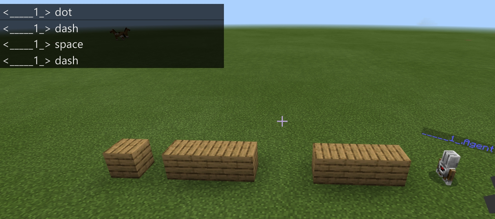
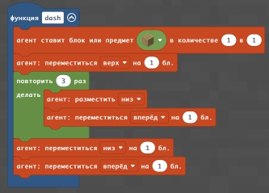
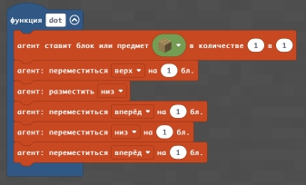
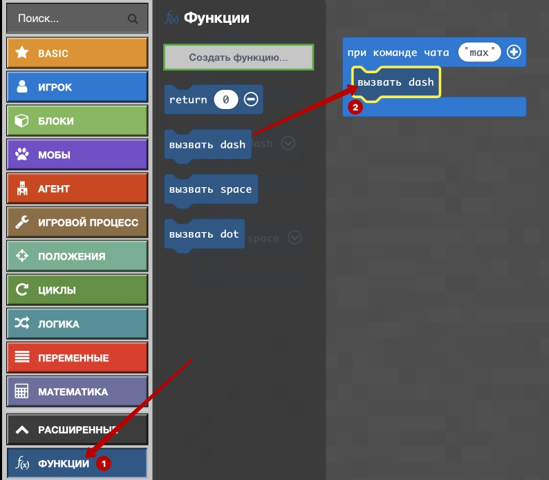

# Специальное занятия №1
На этом занятии мы с вами познакомимся с такими элементами в Minecraft, которые позволят вам самостотятельно творить, придумывая себе практические задания и решая их.
Первый такой шаг - это освоение алфавита. Мы с вами научимся писать буквы и складывать из них слова. Сначала - мы это сделаем в горизонтальном положении. Это смогут сделать все. Усложненный вариант - это создание вертикальных букв.
## Буквы Азбукой Морзе
Самым первым международным кодом передачи информации является азбука Морзе: с ее помощью можно передавать сообщения не только по телеграфу или электронным средствам связи, но и может использоваться с помощью световой сигнализации.

## Азбука Морзе
### Команды чата 
Точка  
  
Тире  
  
Пробел    
  
Написание букв командами в чате  
  

### Функции
Тире:  
Создаем функцию  
     
Даем название     
    
Задаем код  
   
   
Точка:   
Создаем функцию  
   
Даем название   
   
Задаем код   
   
Пробел:  
Создаем функцию  
   

Даем название   
   
Задаем код    
   

### Задание и выполнение команды
Создаем команду чата и переносим в нее блоки вызова функций   
   
Задаем требуемую последовательность вызова команд  
    
Вызываем созданную программу (команда чата max)    
    

## Буквы с прямыми элементами
|#|Задания|Код|Результат|
|---|---|---|---|
|1|1. Напишите деревянными блоками букву A 2. Напишите деревянными блоками букву Б 3. Напишите деревянными блоками букву Е 4. Напишите деревянными блоками букву С 5. Напишите деревянными блоками букву Н |||

## Буквы с диагональными элементами

|#|Задания|Код|Результат| 
|---|---|---|---|
|2|1. Напишите деревянными блоками букву К  2. Напишите деревянными блоками букву И  3. Напишите деревянными блоками букву М  4. Напишите деревянными блоками букву Я  5. Напишите деревянными блоками букву Х |||

