# Квадраты и прямоугольники
|#|Название|Альтернативные задания|Код|Результат|
|---|---|---|---|---|
|1|Квадарт блоков|1. Квадрат 7х7   2. Квадрат 3х3    3. Квадрат 4х4    4. Квадрат 10х10     5. Квадрат 20х20 |<a href = 'https://makecode.com/_fu8fif2z9Dwq'>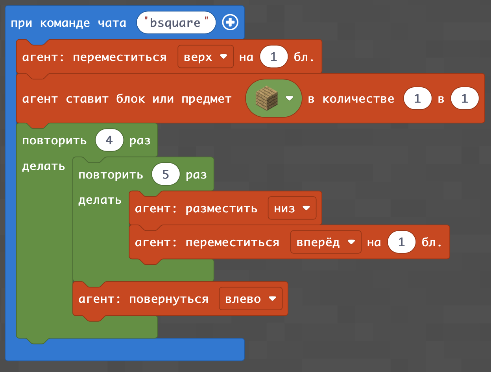</a>|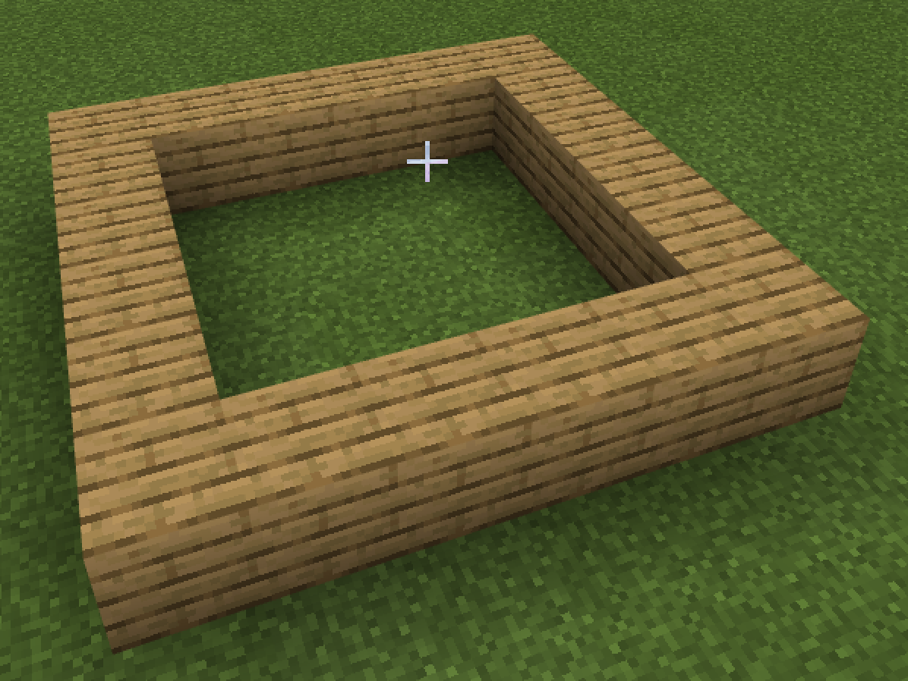|
|2|Квадарт цветов|1. Квадрат 7х7   2. Квадрат 3х3    3. Квадрат 4х4    4. Квадрат 10х10     5. Квадрат 20х20|<a href = 'https://makecode.com/_csKTyratX2kt'>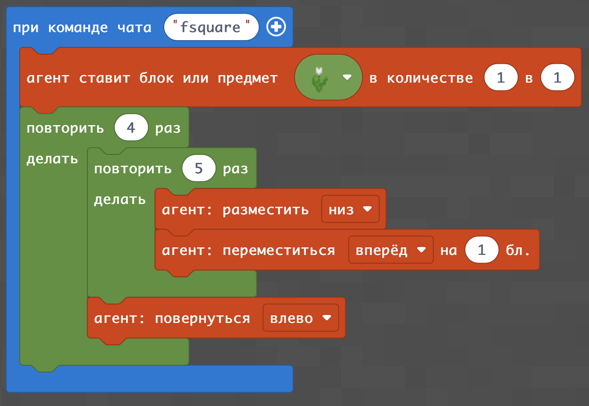</a>|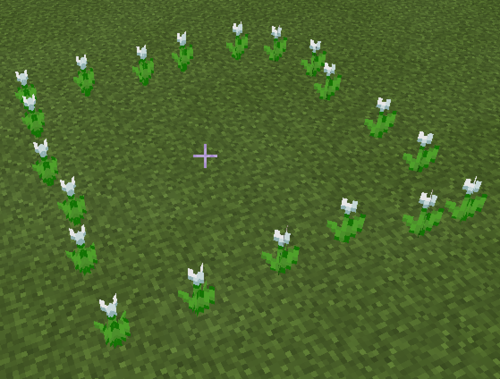|
|3|Прямоугольник блоков|1. Прямоугольник 3х8   2. Прямоугольник 4х9    3. Прямоугольник 4х3   4. Прямоугольник 5х10     5. Прямоугольник 7х20|<a href = 'https://makecode.com/_Xa3X7va5seRE'>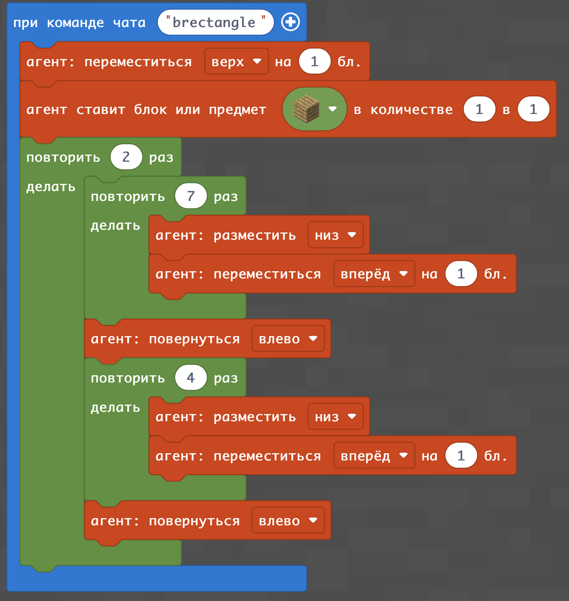</a>|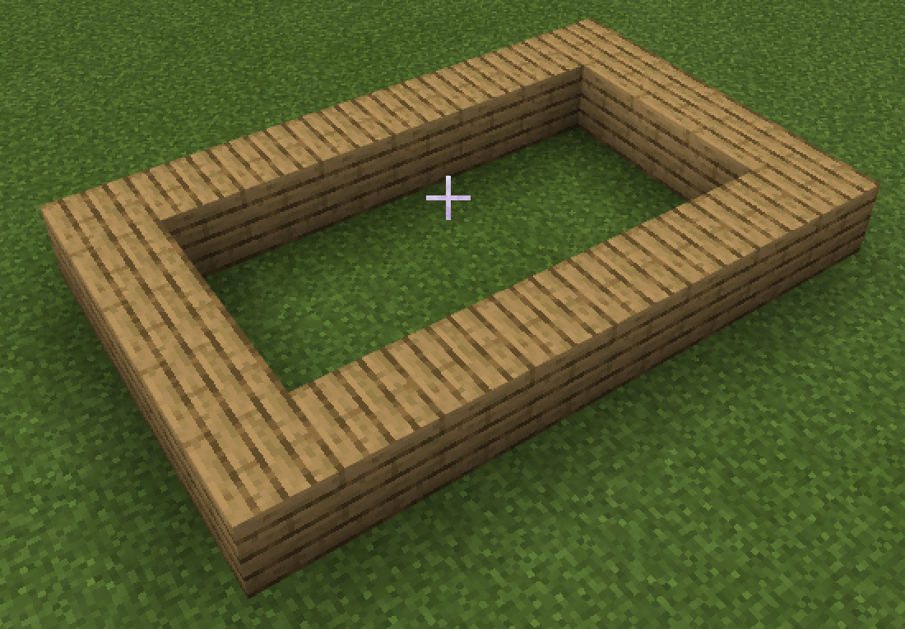|
|4|Прямоугольник цветов|1. Прямоугольник 3х8   2. Прямоугольник 4х9    3. Прямоугольник 4х3   4. Прямоугольник 5х10     5. Прямоугольник 7х20|<a href = 'https://makecode.com/_XRu0FuC9sVzo'>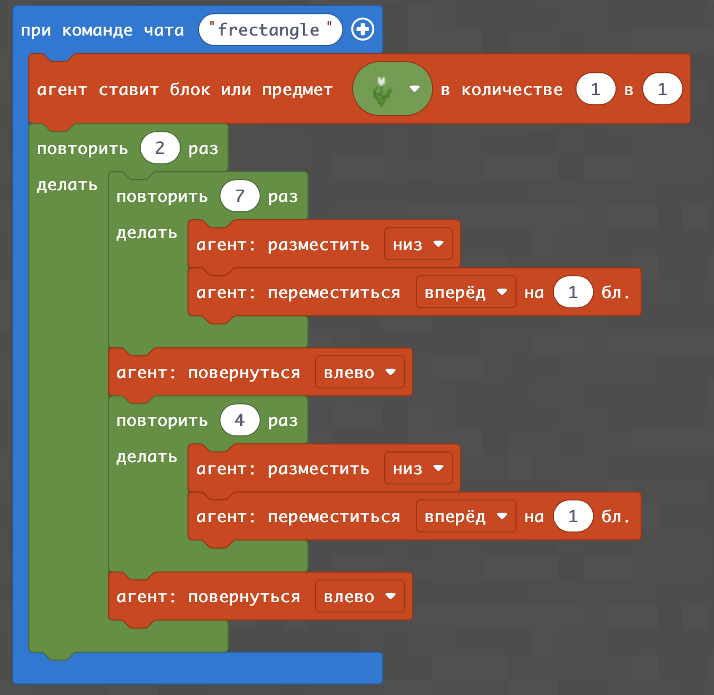</a>|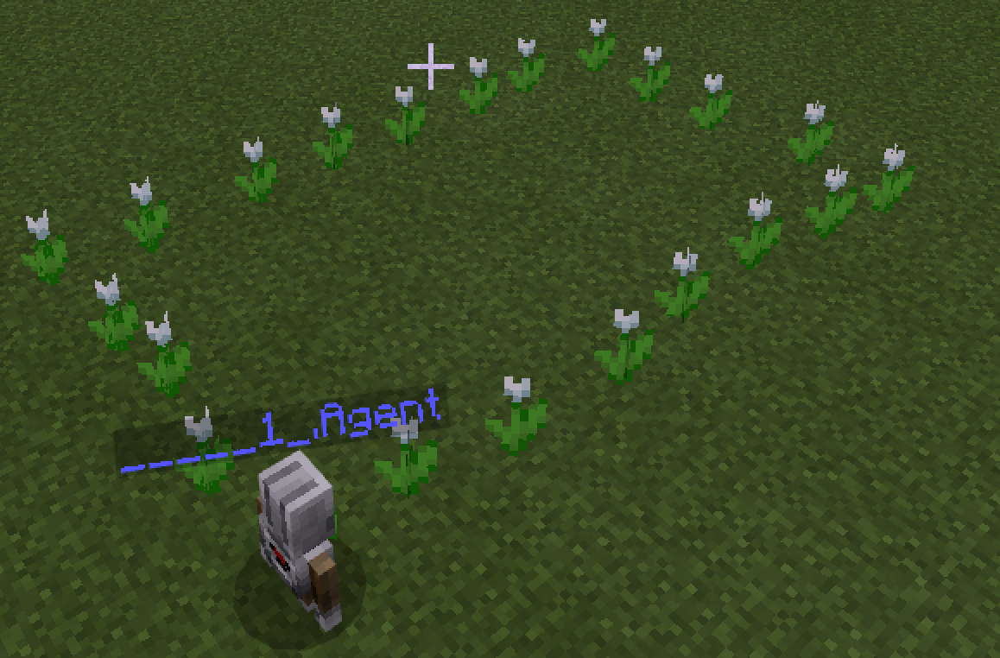|

## Дополнительные задания
1. Рассчитайте периметр и площадь для всех построенных квадратов и прямоугольников:  
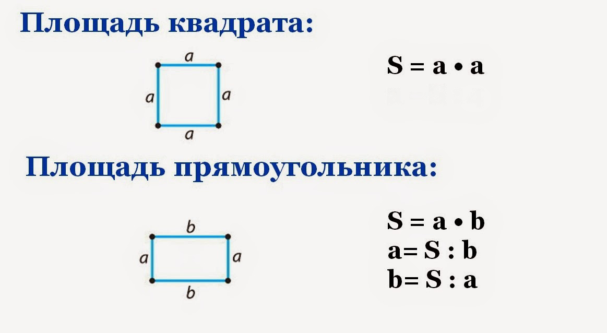  

2. Постройте соответствующие прямоугольники  
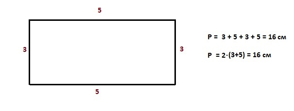  
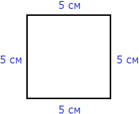   
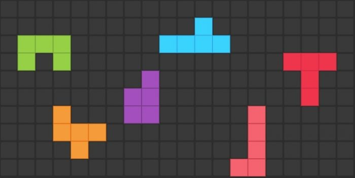   
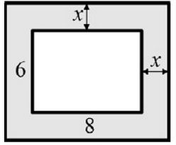   
