# Работа со временем
В **Minecraft** есть система работы со временем:
|Название|name|время|
|---|---|---|
|День|day|0|
|Полдень|noon|6000|	
|Закат|sunset‌|12000|
|Ночь|night|13000|
|Полночь|midnight|18000|
|Восход|sunrise‌|23000|
		
Вы можете просмотреть время с помощью соответсвующей команды:  
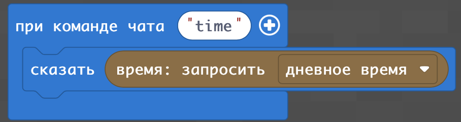  
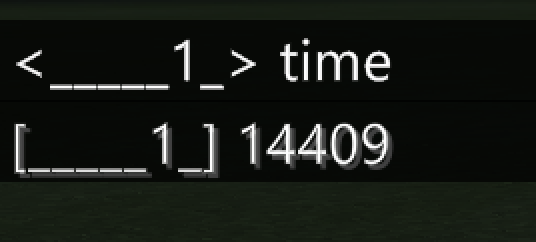  
Вы можете с помощью команду установить соответствующее время:  
|№|Задание|Кода|Результат|
|---|---|---|---|
|1|1. Установите с по помощью команды чата **day** день и выведите сразу после этого дневное время на экран  2. Установите с по помощью команды чата **noon** полдень и выведите сразу после этого дневное время на экран.   3.Установите с по помощью команды чата **sunset‌** закат и выведите сразу после этого дневное время на экран   4. Установите с по помощью команды чата **night** ночь и выведите сразу после этого дневное время на экран 5. Установите с по помощью команды чата **midnight** полночь и выведите сразу после этого дневное время на экран   6. Установите с по помощью команды чата **sunrise‌** восход и выведите сразу после этого дневное время на экран  |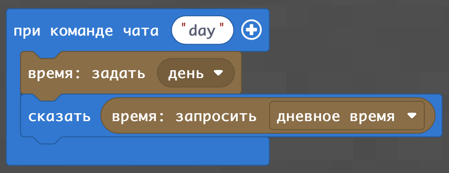  |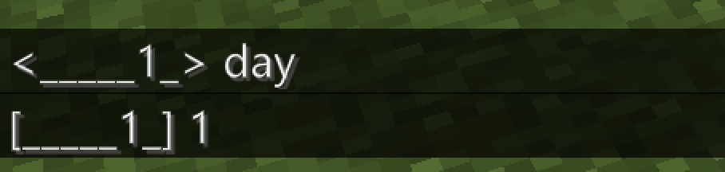 |

Можно обратить внимание, что в работе со временем в Minecraft - есть особенности: 
* Полночь не в 24000, а в 18000 
* Даже при обращении для вывода значения времени сразу после команды ее установки - проходит 1-5 милисекунд.
* Длина времени дня и ночи одинаковые - на день приходдится такое количество временени, что и на ночь.
* Первые два числа (слева) обозначают часы и идут от 0 до 23, а следующие 2 идут от 0 до 99, а не от 0 до 59 (как минуты).

## Вычисление реального времени
### Вычисление количества часов
Для того, чтобы вычислить количество часов - нам нужно взять количество тысяч от значения дневного времени. Для этого разделим значение времени на 1000 и возьмем операцию "усечение" от результата. Для вычисления количество часов сделаем функцию **realhours**, которая будет получать время в Minecraft-формате и возвращать количество часов.
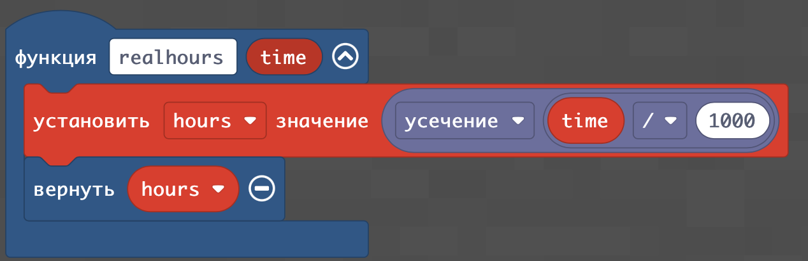  
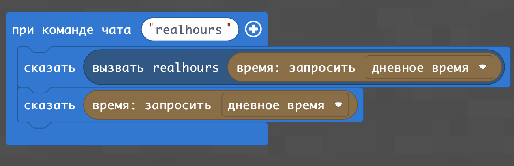  
  
В результате - получим результаты:  
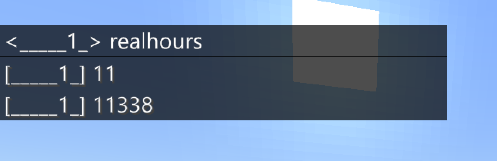  

### Вычисление количества минут
Для вычисления минут нам нужно взять количество секунд (взяв остаток от деления дневного времени на 1000), а далее - применить операцию **отсечение** от результата деления количества секунд на 10. В результате - мы получим минуты в формате от 0 до 99. Для перевода этого формата к **"человеческому"** нам необходимо разделить количество минут в Minecraft на 100 и умножить на 60.
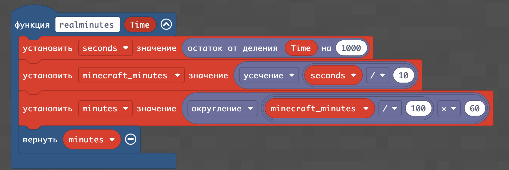  
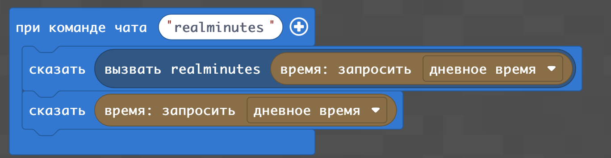  
  
В результате - получим:  
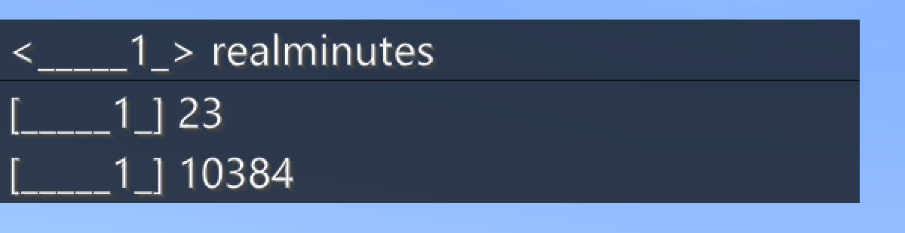  

### Демонстрация времени

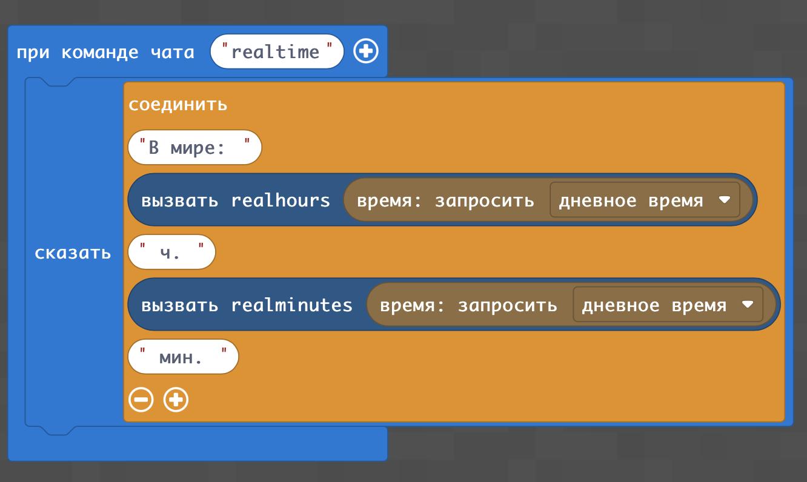  

## Перевод часов в человеческий формат.

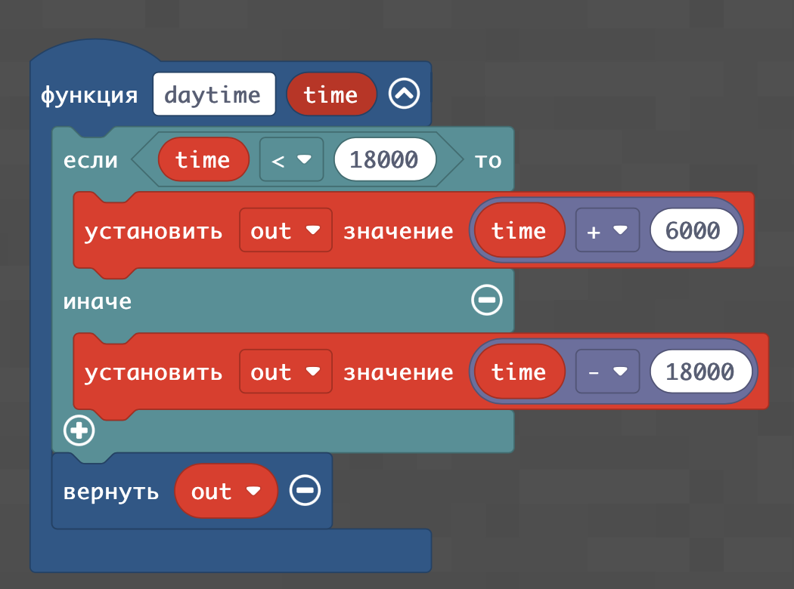  
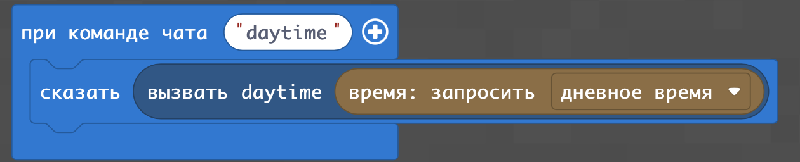  
  
В результате - получим результаты:  
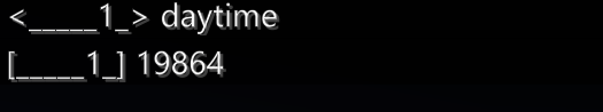  

### Задание
1. Когда по "человеческим часам" начинается день, начинается ночь, начинается восход и начинается закат; в какое время полдень и полночь. 
2. Сделайте в Minecraft такое сообщение команде where
3. Какомим земным дням соответствует баланс длительности дня и ночи в Minecraft.

## Действия по времени

|№|Задание|Кода|Результат|
|---|---|---|---|
|2|1. Сделайте сообщение с текущем временем через каждые 100 секунд, начиная с рассвета.|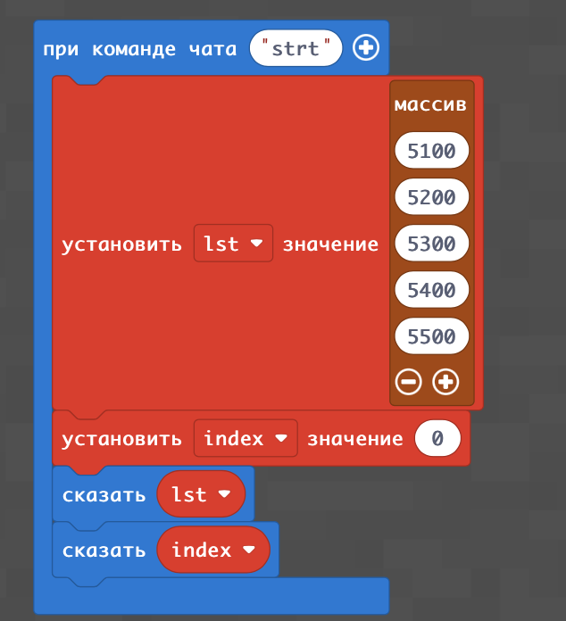 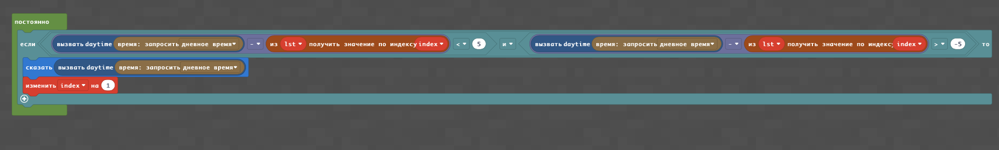 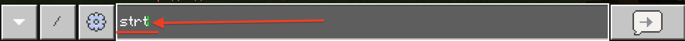 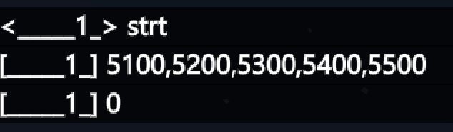 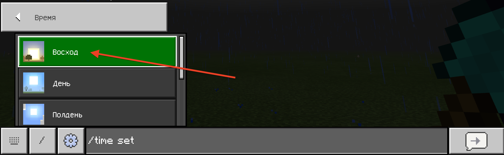 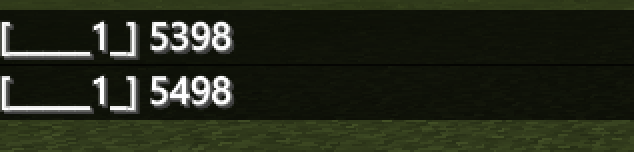 |---|
