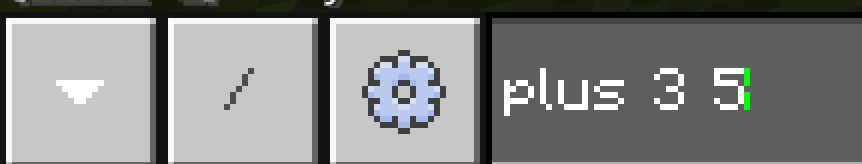
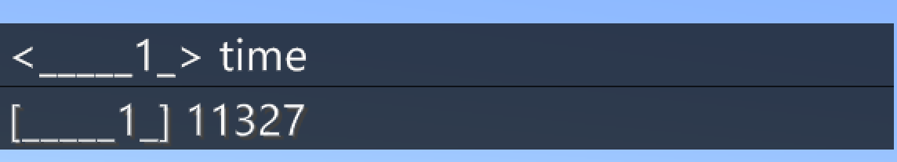

# Работа с цифрами. Рассписание на железной дороге.
С помощью команд в Minecrfat можно производить математические действия.
|Номер|Задания|Код|Изображение|
|---|---|---|---|
|1|1. Создайте программу, которая по команде add складывает два числа.   2. Создайте программу, которая при команде mn вычитает полученные числа одно из другого. 3. Создайте программу, которая при команде mlt перемножат числа.   4. Создайте программу, которая при команде dv делит 2 полученных числа одно на другое. || |

|Номер|Задания|Код|Изображение|
|---|---|---|---|
|2|1. Создайте программу, которая по команде plus складывает два числа.   2. Создайте программу, которая при команде minus вычитает полученные числа одно из другого. 3. Создайте программу, которая при команде mult перемножат числа.   4. Создайте программу, которая при команде div делит 2 полученных числа одно на другое. || |

## Работа со временем
Вы можете запросить текущее время в игре, использовав команду **time**.

|Номер|Задания|Код|Изображение|
|---|---|---|---|
|3|1. Запустите просмотр времени|||

## Отображение промежутков времени

|Номер|Задания|Код|Изображение|
|---|---|---|---|
|4|1. Запустите просмотр времени в течении 200 секунд с промежутком в 20 секунд.   2. Запустите просмотр времени в течении 100 секунд с промежутком в 10 секунд.  3. Запустите просмотр времени в течении 250 секунд с промежутком в 30 секунд.|||
