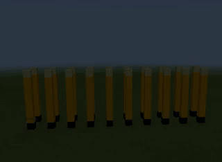

# Постройка по фотографии
## Колонна
Для постройки здания по фотографии в Minecraft нам необходимо взять его фотографию, а далее - определить пропорции. А точнее - расставить кубики по зданию.
  
Для этого удобно в графическом редакторе подобрать размер минимального элемента (блока) и по нему разметить фотографию.
  
В дальнейшем на уроке мы будем строить здание харьковского вокзала шаг за шагом.
|Номер|Задания|Код|Изображение|
|---|---|---|---|
|1|1. Создать колонну у которой будет такая структура: 1 черный блок, 6 желтых, 1 белый с узорами (камень края). Колонна должна начинаться в точке (0;4;0)<br>2. Создать колонну в два раза больше предыдущей<br>3. Создать колонну из элементов 1 черный блок, 6 желтых, 1 белый с узорами (камень края). Колонна должна начинаться в точке (3;4;0)<br> 1 черный блок, 6 желтых, 1 белый с узорами (камень края). Колонна должна начинаться в точке (0;4;-3)|player.onChat("column", function () {<br>    let x = 0<br>    blocks.place(BLACK_CONCRETE, world(x * 3, 4, 0))<br>    for (let y = 0; y <= 6; y++) {<br>        blocks.place(YELLOW_CONCRETE, world(x * 3, 5 + y, 0))<br>    }<br>    blocks.place(ENDSTONE, world(x * 3, 12, 0))<br>})||

### Творческое задание
Найти в Интернете изображение колонны (в здании или отдельно) и построить ее аналог в Minecraft.

## Ряд колонн
Часто нам необходимо построить не одну колонну, а ряд колонн.


|Номер|Задания|Код|Изображение|
|---|---|---|---|
|2|1. Построить ряд из 10 колонн, в которых колонны состоят из такой структуры:  черный блок, 6 желтых, 1 белый с узорами (камень края). При этом отступ между колоннами 2 блока. Ряд колонн начинается из точки (0;4;0)<br> 2. Построить ряд из 5 колонн, в которых колонны состоят из такой структуры:  черный блок, 6 желтых, 1 белый с узорами (камень края). При этом отступ между колоннами 3 блока. Ряд колонн начинается из точки (0;4;0).<br>3. Построить ряд из 10 колонн, в которых колонны состоят из такой структуры:  черный блок, 6 желтых, 1 белый с узорами (камень края). При этом отступ между колоннами 2 блока. Ряд колонн начинается из точки (0;4;-3) |player.onChat("columns", function () {<br>    for (let x = 0; x <= 9; x++) {<br>        blocks.place(BLACK_CONCRETE, world(x * 3, 4, 0))<br>        for (let y = 0; y <= 6; y++) {<br>            blocks.place(YELLOW_CONCRETE, world(x * 3, 5 + y, 0))<br>        }<br>        blocks.place(ENDSTONE, world(x * 3, 12, 0))<br>    }<br>})||


## Ряды колонн
|Номер|Задания|Код|Изображение|
|---|---|---|---|
|3|1. Построить 2 ряд из 10 колонн, в которых колонны состоят из такой структуры:  черный блок, 6 желтых, 1 белый с узорами (камень края). При этом отступ между колоннами 2 блока. Первый ряд колонн начинается из точки (0;4;0), Второй ряд начинается из точек|player.onChat("columns2", function () {<br>    for (let x = 0; x <= 9; x++) {<br>        blocks.place(BLACK_CONCRETE, world(x * 3, 4, 0))<br>        for (let y = 0; y <= 6; y++) {<br>            blocks.place(YELLOW_CONCRETE, world(x * 3, 5 + y, 0))<br>        }<br>        blocks.place(ENDSTONE, world(x * 3, 12, 0))<br>    }<br>    for (let x = 0; x <= 9; x++) {<br>        blocks.place(BLACK_CONCRETE, world(x * 3, 4, -3))<br>        for (let y = 0; y <= 6; y++) {<br>            blocks.place(YELLOW_CONCRETE, world(x * 3, 5 + y, -3))<br>        }<br>        blocks.place(ENDSTONE, world(x * 3, 12, -3))<br>    }<br>})||

## Очистка построенного
Часто бывает необходимо отчистить уже построенное пространство. Для этого - пространство над землей необходимо заполнить блоками воздуха, а на уровне земли - блоками травы.
|Номер|Задания|Код|Изображение|
|---|---|---|---|
|4|1. Очистить пространство, заполнив блоками воздуха от (0;4;0) до (30;23;-17), а пространство между  от (0;3;0) до (30;3;-17)|player.onChat("clear", function () {<br>    blocks.fill(<br>    AIR,<br>    world(0, 4, 0),<br>    world(30, 23, -17),<br>    FillOperation.Replace<br>    )<br>    blocks.fill(<br>    GRASS,<br>    world(0, 3, 0),<br>    world(30, 3, -17),<br>    FillOperation.Replace<br>    )<br>})||
```js
player.onChat("clear", function () {
    blocks.fill(
    AIR,
    world(0, 4, 0),
    world(30, 23, -17),
    FillOperation.Replace
    )
    blocks.fill(
    GRASS,
    world(0, 3, 0),
    world(30, 3, -17),
    FillOperation.Replace
    )
})
```
## Постройка перекрытий
|Номер|Задания|Код|Изображение|
|---|---|---|---|
|5|1. Построить верхнюю часть вокзала|см. ниже||

```js
player.onChat("building", function () {
    blocks.fill(
    SANDSTONE,
    world(0, 13, 0),
    world(27, 14, -3),
    FillOperation.Replace
    )
    blocks.fill(
    YELLOW_WOOL,
    world(3, 15, 0),
    world(4, 16, 0),
    FillOperation.Replace
    )
    blocks.fill(
    WHITE_GLAZED_TERRACOTTA,
    world(3, 17, 0),
    world(4, 20, 0),
    FillOperation.Replace
    )
    blocks.fill(
    YELLOW_WOOL,
    world(24, 15, 0),
    world(23, 16, 0),
    FillOperation.Replace
    )
    blocks.fill(
    WHITE_GLAZED_TERRACOTTA,
    world(24, 17, 0),
    world(23, 20, 0),
    FillOperation.Replace
    )
    blocks.fill(
    GOLD_BLOCK,
    world(20, 15, 0),
    world(22, 15, 0),
    FillOperation.Replace
    )
    blocks.fill(
    GOLD_BLOCK,
    world(19, 16, 0),
    world(21, 16, 0),
    FillOperation.Replace
    )
    blocks.fill(
    GOLD_BLOCK,
    world(17, 17, 0),
    world(20, 17, 0),
    FillOperation.Replace
    )
    blocks.fill(
    GOLD_BLOCK,
    world(17, 18, 0),
    world(9, 18, 0),
    FillOperation.Replace
    )
    blocks.fill(
    GOLD_BLOCK,
    world(16, 19, 0),
    world(11, 19, 0),
    FillOperation.Replace
    )
    blocks.place(YELLOW_CONCRETE, world(14, 21, 0))
    blocks.place(YELLOW_CONCRETE, world(13, 21, 0))
    blocks.place(BLUE_CONCRETE, world(13, 20, 0))
    blocks.place(BLUE_CONCRETE, world(14, 20, 0))
    blocks.fill(
    BLACK_STAINED_GLASS,
    world(19, 15, 0),
    world(8, 15, 0),
    FillOperation.Replace
    )
    blocks.fill(
    BLACK_STAINED_GLASS,
    world(18, 16, 0),
    world(9, 16, 0),
    FillOperation.Replace
    )
    blocks.fill(
    BLACK_STAINED_GLASS,
    world(16, 17, 0),
    world(11, 17, 0),
    FillOperation.Replace
    )
    blocks.fill(
    GOLD_BLOCK,
    world(7, 15, 0),
    world(5, 15, 0),
    FillOperation.Replace
    )
    blocks.fill(
    GOLD_BLOCK,
    world(8, 16, 0),
    world(6, 16, 0),
    FillOperation.Replace
    )
    blocks.fill(
    GOLD_BLOCK,
    world(10, 17, 0),
    world(7, 17, 0),
    FillOperation.Replace
    )
    blocks.fill(
    BLACK_CONCRETE,
    world(0, 4, 0),
    world(27, 4, -3),
    FillOperation.Replace
    )
    blocks.fill(
    YELLOW_GLAZED_TERRACOTTA,
    world(0, 4, -4),
    world(27, 14, -14),
    FillOperation.Replace
    )
})
```


