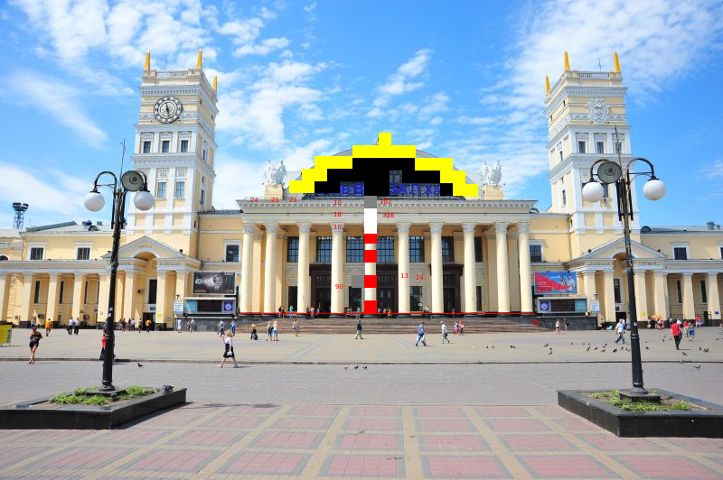
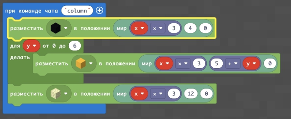
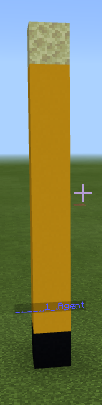
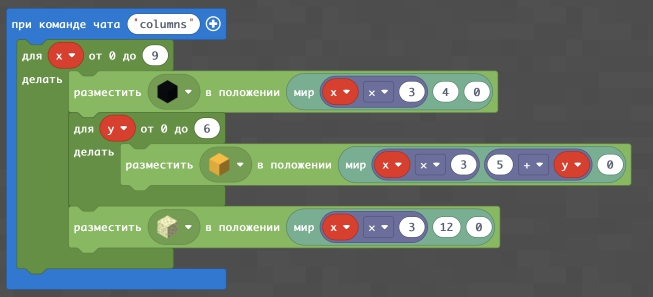
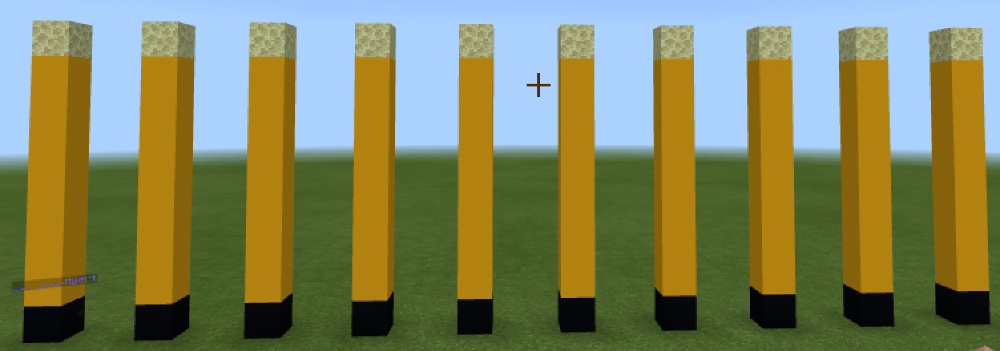
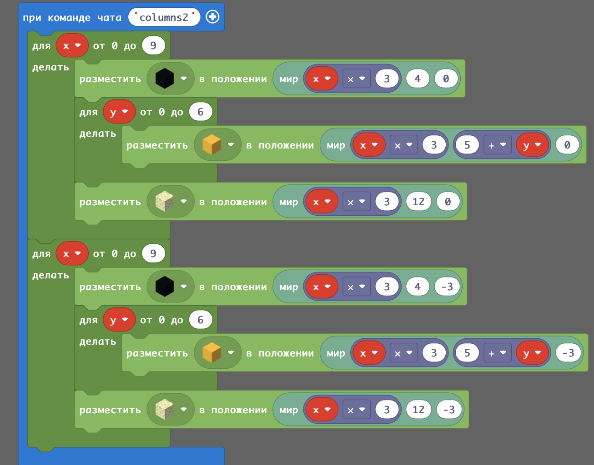
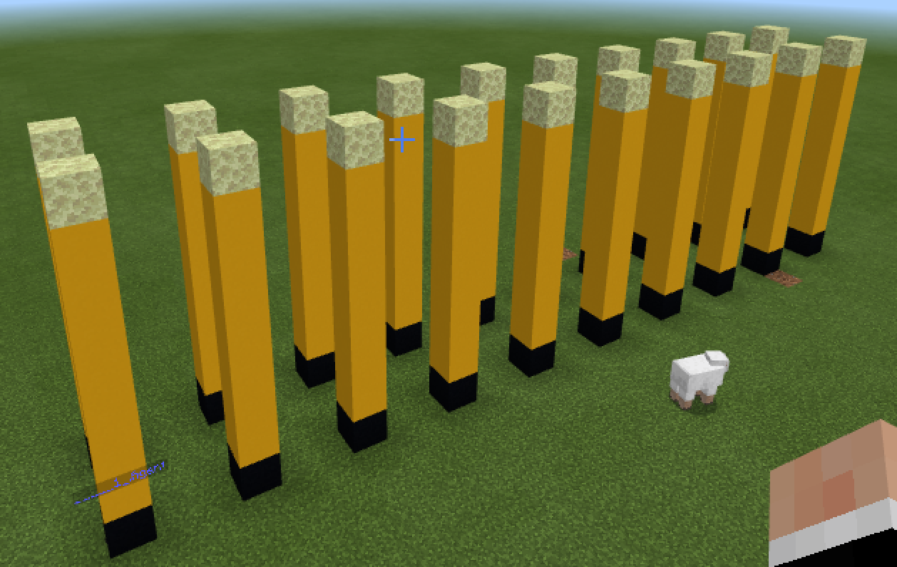

# Постройка по фотографии
## Колонна
Для постройки здания по фотографии в Minecraft нам необходимо взять его фотографию, а далее - определить пропорции. А точнее - расставить кубики по зданию.
  
Для этого удобно в графическом редакторе подобрать размер минимального элемента (блока) и по нему разметить фотографию.
  
В дальнейшем на уроке мы будем строить здание харьковского вокзала шаг за шагом.
|Номер|Задания|Код|Изображение|
|---|---|---|---|
|1|1. Создать колонну у которой будет такая структура: 1 черный блок, 6 желтых, 1 белый с узорами (камень края). Колонна должна начинаться в точке (0;4;0) 2. Создать колонну в два раза больше предыдущей 3. Создать колонну из элементов 1 черный блок, 6 желтых, 1 белый с узорами (камень края). Колонна должна начинаться в точке (3;4;0)  1 черный блок, 6 желтых, 1 белый с узорами (камень края). Колонна должна начинаться в точке (0;4;-3)|||

### Творческое задание
Найти в Интернете изображение колонны (в здании или отдельно) и построить ее аналог в Minecraft.

## Ряд колонн
Часто нам необходимо построить не одну колонну, а ряд колонн.

|Номер|Задания|Код|Изображение|
|---|---|---|---|
|2|1. Построить ряд из 10 колонн, в которых колонны состоят из такой структуры:  черный блок, 6 желтых, 1 белый с узорами (камень края). При этом отступ между колоннами 2 блока. Ряд колонн начинается из точки (0;4;0)  2. Построить ряд из 5 колонн, в которых колонны состоят из такой структуры:  черный блок, 6 желтых, 1 белый с узорами (камень края). При этом отступ между колоннами 3 блока. Ряд колонн начинается из точки (0;4;0). 3. Построить ряд из 10 колонн, в которых колонны состоят из такой структуры:  черный блок, 6 желтых, 1 белый с узорами (камень края). При этом отступ между колоннами 2 блока. Ряд колонн начинается из точки (0;4;-3) |||

## Ряды колонн
|Номер|Задания|Код|Изображение|
|---|---|---|---|
|3|1. Построить 2 ряд из 10 колонн, в которых колонны состоят из такой структуры:  черный блок, 6 желтых, 1 белый с узорами (камень края). При этом отступ между колоннами 2 блока. Первый ряд колонн начинается из точки (0;4;0), Второй ряд начинается из точек|||

