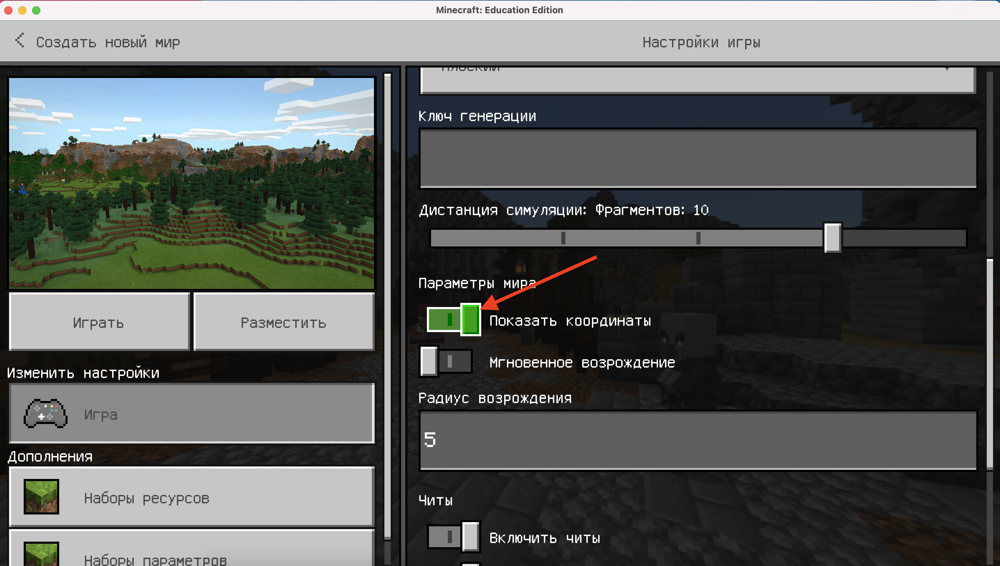
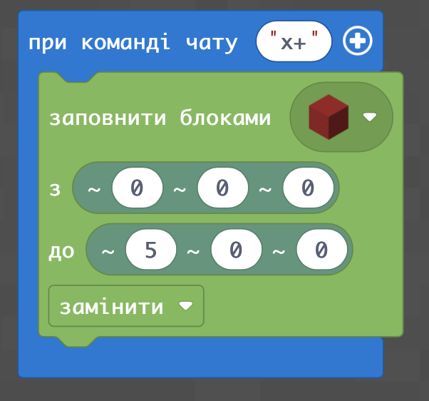
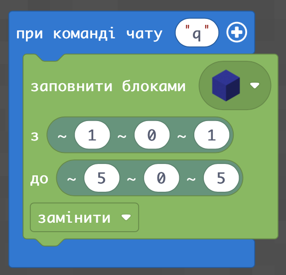
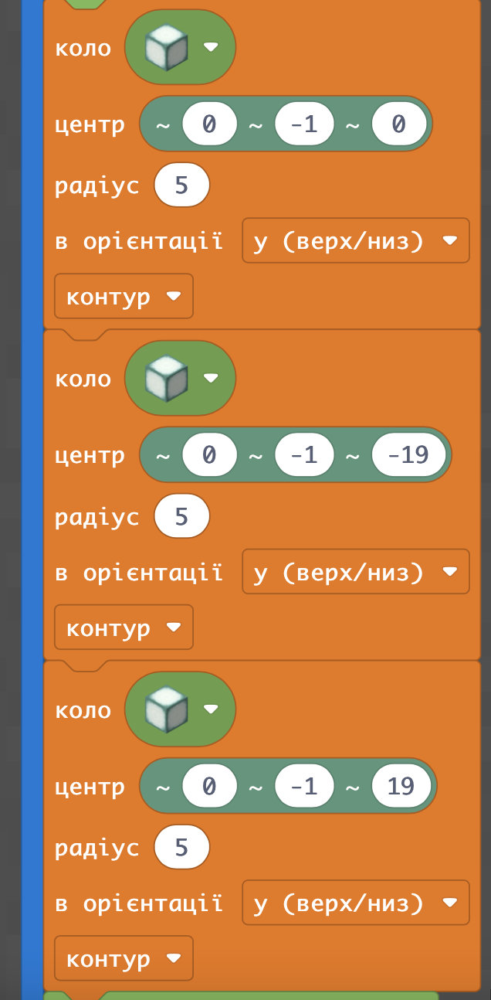
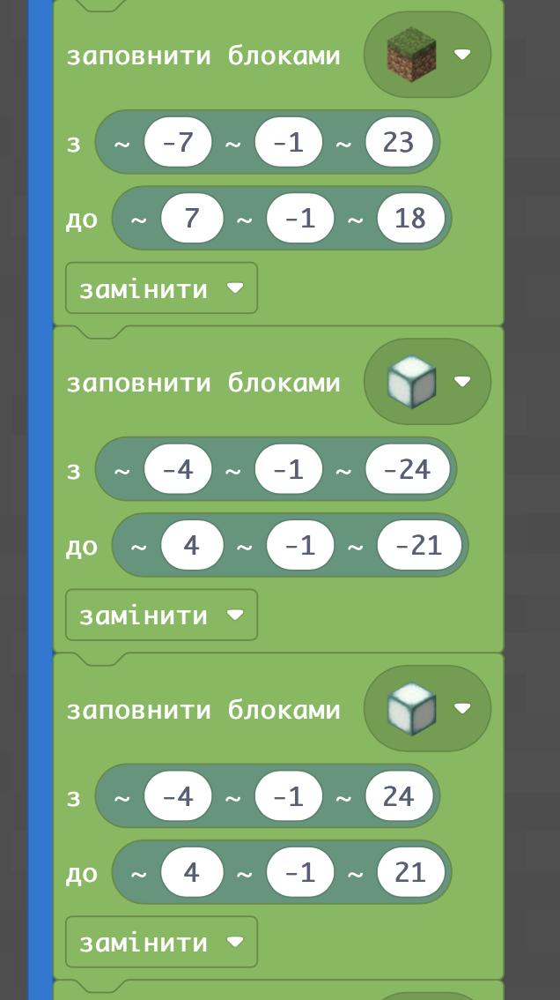
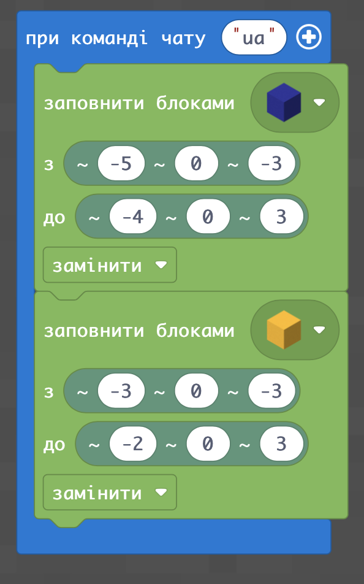
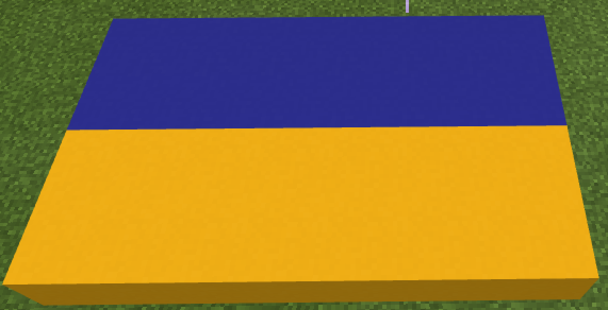

# Флаги по координатам
## Координаты и направления в Minecraft
В Minecraft есть система координат. При создании мира (а также после его создания) в настройках можно включить отображение координат:
  
В результате - получим отображение координат:  
  
Мы видим три числа через запятуюю По-умолчанию игрок стоит в точке с координатой (0;4;0). Что это значит? Это значает игрок стоит в точке, в которой первая координата (x-координата) и третья координата (z-координата) равняется нулю). x и z координаты будут показывать направление движения вперед-назад и вправо-влево.
  
В Minecraft мы имеем специальный бллок "Заполнить блоками", который позволяет ставить блоки по координатам. Координаты прокладываются с помощью относительных координат (где должны быть размещены блоки относительно игрока)
|#|Задание|Код|Результат|
|---|---|---|---|
|1|1.Проложите линию из6 блоков красного бетона от координаты (~0;~0;~0) до координаты (~5;~0;~0)   2.Проложите линию из 6 блоков белого от координаты (~0;~0;~0) до координаты (~-5;~0;~0) 2.Проложите линию из 5 блоков желтого бетона от координаты (~0;~0;~1) до координаты (~0;~0;~5)   3.Проложите линию из 5 блоков синего бетона от координаты (~0;~0;~-1) до координаты (~0;~0;~-5)|||

## Квадраты и прямоугольники (флаги).
Если в команду "Заполнить блоками водить координаты с изменением не по одному направлению, а по 2-м - получится прмоугольник:
|#|Задание|Код|Результат|
|---|---|---|---|
|1|1.Создайте квадрат 5 x 5 из 5 блоков синего бетона от координаты (~1;~0;~1) до координаты (~5;~0;~5)   2.Проложите линию из 5 блоков белого от координаты (~0;~0;~0) до координаты (~-5;~0;~0) 2.Проложите линию из 4 блоков желтого бетона от координаты (~0;~0;~1) до координаты (~0;~0;~5)   3.Проложите линию из 4 блоков синего бетона от координаты (~0;~0;~-1) до координаты (~0;~0;~-5)|||

Делаем прямоугольник с помощью агента.

## Квадраты и прямоугольники (флаги).
Делаем то же действие с помощью относительных координат.
1. Ставим элементы по точкам.
2. Ставим квадрат, прямоугольник в далее от себя

### Специальное задание (футбольное поле)
Следующее задание - мы сделаем тематическим. Для начала - мы разметим футбольное поле, а далее - разместим возле кромки поля флаги стран.  
Внешний вид футбольного поля:  
  

 
Код для разметки футбольного поля:  
|Часть 1|Часть 2|
|---|---|
| |  |

### Флаги  
Флаги - это несколько разноцветных прямоугольников, которые размещаются рядом.
Для того, чтобы рассчитать координаты для флага, можно воспользоваться электронными таблицами. Для чего?  
Координаты, которые указаны после символа ~ отчитываются от положения игрока (это называется относительными). Программа отсчитывает от игрока расстояние и ставит блок в соответствующее место.
Первая координата - это координата по оси `X` (ширина), `Y` (высота), `Z` (длина). На первом этапе - мы будем работать только с `X` и `Z` (блоки будут размещаться на той же высоте, на которой находится игрок).

Могут быть два варианта рассчета координат: вы можете построить аналогичный элемент "вручную" и дальше - посчитать координаты в самом Minecraft, а можете - сделать схему будущих элементов в [электронных таблицах](https://docs.google.com/spreadsheets/d/136eUBLEor4fnmaHps9ZuCxqT0tdelbtWAvJ_NQV9GPY/edit#gid=1252612500)  
   
Левый нижний угол синей части украинского флага (синего прямоугольника) - находится в точке (-5;-3), а правый верхний в точке (-4;3). 
Соответственно в команде по размещению блоков мы напишем, что необходимо заполнить блоками пространство от точки (-5;0;-3) до точки (-4;0;3).  
Аналогично рассчитываются координаты для желтой части флага.

|#|Название|Альтернативные задания|Код|Результат|
|---|---|---|---|---|
|2|Линия блоков| 1. Флаг Украины   2. Флаг Польши   3. Флаг Венгрии   4. Флаг Болгарии  5. Флаг Австрии | | |

### Творческое задание
Соедените созданное футбольное поле и подготовленные флаги:  

### Супртворческое задание
Поставьте флаги на флагштоках
